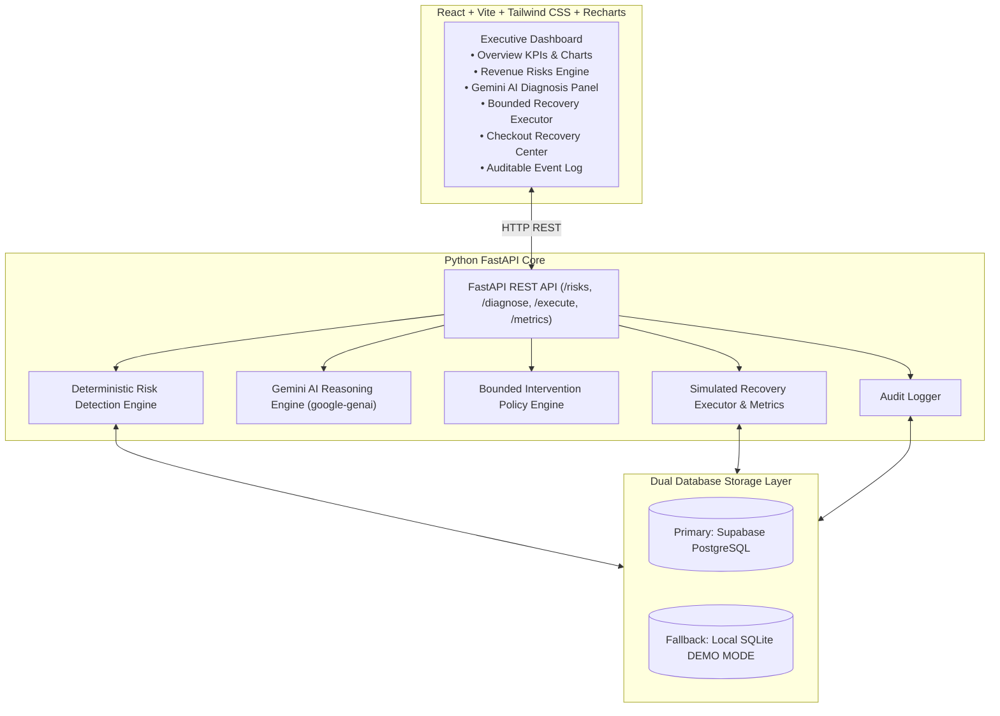

# Razorpay AI Buildathon Track 03 — AI Revenue Recovery System

An enterprise-grade, production-ready **AI Revenue Recovery Agent** that detects revenue at risk, diagnoses root causes with Google Gemini AI, enforces bounded intervention rules, executes simulated recovery workflows, and proves money recovered with an auditable trial.

---

## Architecture Diagram



---

## System Capabilities & Core Loop

The application demonstrates the end-to-end recovery loop:
1. **DETECT**: Python engine calculates factual baseline vs. recent failure rates and checkout abandonment drop-offs to discover pattern anomalies (e.g. evening UPI gateway technical degradation, checkout session payment step drop-offs).
2. **DIAGNOSE**: Python feeds factual evidence into Google Gemini API (`google-genai`). Gemini generates root-cause hypotheses, confidence ratings, and intervention recommendations.
3. **DECIDE**: Bounded intervention policy engine enforces eligibility rules, retry limits (Max 3 attempts), retry intervals, and stop-conditions before execution.
4. **EXECUTE**: Simulated recovery executor executes bounded actions (`payment_retry`, `checkout_reminder`, `alternate_payment_method_prompt`) with realistic success probabilities.
5. **RECOVER & PROVE**: Real-time metric engine aggregates total revenue at risk, eligible recovery amount, total recovered money (₹), and recovery rate (%).
6. **AUDIT**: Every single detection, diagnosis, approval, attempt, and stop event is logged in an immutable audit trail.

---

## Core Data Model (7 Core Tables)

1. `merchants` — Merchant profile (id, name, currency, created_at)
2. `customers` — Customer entity (id, merchant_id, name, email, customer_segment)
3. `checkout_sessions` — Checkout flow (id, customer_id, cart_amount, payment_method, stage, status, recovery_status)
4. `transactions` — Payment attempts (id, customer_id, amount, payment_method, status, failure_reason)
5. `recovery_cases` — Identified risk cases (id, source_type, amount_at_risk, risk_score, diagnosis, recommended_action, status)
6. `recovery_attempts` — Executed recovery actions (id, recovery_case_id, attempt_number, action_type, result, recovered_amount, stop_reason)
7. `audit_logs` — Immutable audit log (id, recovery_case_id, event_type, actor, details, created_at)

---

## Setup & Local Installation Guide

### Prerequisites
- Python 3.9+
- Node.js 18+

### 1. Environment Setup

Copy `.env.example` to `.env`:
```powershell
cp .env.example .env
```

Set your API credentials in `.env`:
```env
SUPABASE_URL=https://your-project-id.supabase.co
SUPABASE_KEY=your-supabase-anon-key
GEMINI_API_KEY=your-gemini-api-key
```

*Note: If Supabase credentials are missing, the system runs locally in **LOCAL DEMO MODE** using SQLite (`data/revenue_recovery_demo.db`). If `GEMINI_API_KEY` is unconfigured, the system uses a structured deterministic AI fallback engine.*

### 2. Backend Setup & Data Seeding

Run setup and seed the 90-day synthetic dataset (~8,500 transactions, ~5,500 checkout sessions):

```powershell
# Install backend dependencies
.\.venv\Scripts\python -m pip install -r backend/requirements.txt

# Idempotently seed dataset
.\.venv\Scripts\python -m backend.seed

# Start FastAPI Backend Server
.\.venv\Scripts\python -m uvicorn backend.main:app --reload --port 8000
```

Backend Swagger Docs available at: `http://localhost:8000/docs`

### 3. Frontend Setup

In a separate terminal:
```powershell
# Install frontend dependencies & run Vite dev server
npm install --prefix frontend
npm run dev --prefix frontend
```

Frontend app available at: `http://localhost:5173`

---

## Running Automated Tests

Run the full pytest suite testing detection math, intervention rules, recovery executor, metrics, and audit logging:

```powershell
.\.venv\Scripts\python -m pytest tests/test_revenue_recovery.py
```

---

## 5-Minute Judge Demo Script

1. **Open Frontend App**: Navigate to `http://localhost:5173`. Observe the header badges: `DEMO / SIMULATED RECOVERY` and Database Mode (`Supabase Postgres` or `Local SQLite Demo`).
2. **Review Executive Dashboard (Tab 1)**: Observe **Revenue at Risk** (e.g. ₹10.2L), **Proven Recovered Amount**, **Recovery Rate**, and trend charts.
3. **Inspect Revenue Risks (Tab 2)**: Note detected anomalies:
   - **Payment Degradation**: High-risk score (~87/100) on UPI evening technical failures.
   - **Checkout Abandonment**: High-value abandoned carts at the `payment` stage.
4. **Run AI Diagnosis (Tab 3)**: Click **Diagnose with AI**. Observe Gemini's root-cause hypothesis, 91% confidence rating, rationale, and bounded safety constraints (Max 3 attempts, stop on success).
5. **Approve Recovery**: Click **Approve Recovery Workflow**.
6. **Execute Bounded Recovery (Tab 4)**: Click **Execute Attempt**. Watch Attempt 1 execute with simulated probability. Click **View Timeline** to see the interactive visual step-by-step progress.
7. **Verify Money Recovered (Tab 1)**: Return to Overview to see the recovered amount (e.g. ₹2.45L) reflected in live KPI cards.
8. **Inspect Audit Trail (Tab 6)**: Click **Audit Trail** to inspect complete logs (`DETECTION → DIAGNOSIS → APPROVAL → EXECUTION → RECOVERY → STOP`).
