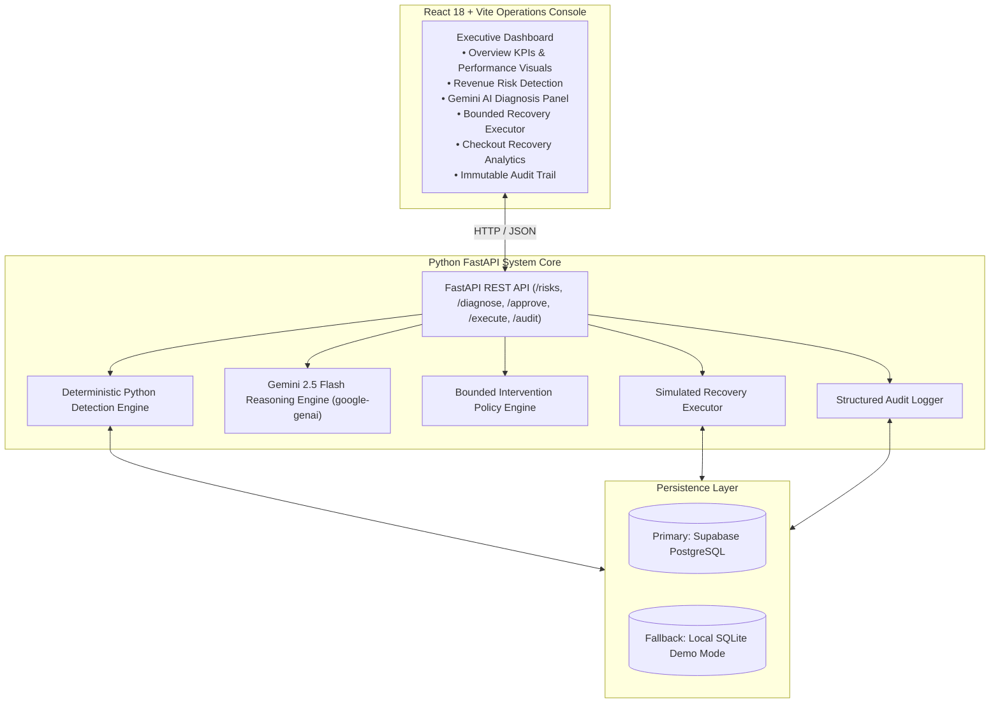

# AI Revenue Recovery — Razorpay Buildathon Track 03

An AI-powered revenue recovery system that detects revenue at risk, diagnoses why it is slipping, selects a bounded intervention, executes simulated recovery, and proves the recovered amount.

---

## Architecture Overview



---

## Key System Concepts

### 1. Problem
Payment degradation events (e.g. gateway timeouts, bank technical errors) and high-value checkout session abandonment cause massive revenue leakage for digital merchants. Simply detecting that transactions failed is insufficient; merchants need automated root-cause diagnosis, intelligent intervention selection, and policy-bounded recovery execution.

### 2. Solution: Closed-Loop Recovery Flow
```
Detect (Python) → Diagnose (Gemini AI) → Determine Intervention (Policy Engine) → Bounded Execution (Recovery Engine) → Prove Recovery (Audit Log)
```

### 3. Clear AI Role Distinction
- **Python Code**: Calculates all factual financial and operational metrics (baseline failure rates, recent anomaly spikes, percentage-point deltas, affected transaction volumes, and exact amounts at risk).
- **Google Gemini 2.5 Flash**: Reasons over the structured statistical evidence provided by Python to form root-cause hypotheses, assess confidence ratings, and recommend interventions.
- **Gemini does NOT calculate or invent financial numbers**.
- **Policy Engine**: Enforces safety constraints (max retry limits, stop conditions) to ensure execution remains safe and predictable.

---

## Current Demo Results (Synthetic Dataset)

*Results calculated dynamically from the 90-day synthetic benchmark dataset (~8,500 transactions, ~5,500 checkout sessions):*

| Metric | Value | Description |
| :--- | :--- | :--- |
| **Total Revenue at Risk** | **₹1,021,629.62** | Identified revenue leakage across payment degradation and checkout abandonment |
| **Simulated Revenue Recovered** | **₹185,923.98** | Revenue recovered in the synthetic benchmark through the bounded recovery workflow. |
| **Recovery Rate** | **18.2%** | Ratio of recovered revenue relative to total identified risk |
| **Primary Demo Case** | **`risk_pay_deg_01`** | Elevated UPI payment degradation event during peak hours (18:00 - 22:00) |
| **Gemini Diagnosis** | **`gemini-2.5-flash`** | Root cause: UPI infrastructure technical error spike (92% confidence rating) |
| **Executed Action** | **`alternate_payment_method_prompt`** | Recommended by Gemini and approved under safety policy constraints |
| **Stop Condition** | **`recovered_successfully`** | Bounded workflow terminated upon successful simulated recovery |

---

## Safety, Guardrails & Bounded Execution

- **Simulated Recovery**: No live payment gateway debits or unrestricted money movements occur.
- **Strict Bounded Attempts**: Maximum **3 recovery attempts** per case.
- **Explicit Stop Conditions**: Execution halts immediately on payment success, customer opt-out, or max attempts reached.
- **Human-in-the-Loop Approval**: Cases require explicit policy approval (`approved` state) prior to execution.
- **Immutable Audit Logging**: Every event (`DETECTION → DIAGNOSIS → APPROVAL → EXECUTION → RECOVERY → STOP`) is logged with structured JSON details.
- **Data Privacy**: Built using 100% synthetic merchant and customer data.

---

## 2-Minute Judge Walkthrough Script

1. **Open Console**: Open the Vite frontend URL shown in the terminal (for example, http://localhost:5174). Check header badges (`DATABASE: Supabase Connected`, `AI STATUS: Gemini Live`).
2. **Executive Overview (Tab 1)**: Inspect top KPIs (**Revenue at Risk**: ₹1,021,629.62, **Simulated Revenue Recovered**: ₹185,923.98, **Recovery Rate**: 18.2%) and the horizontal **Recovery Performance** ratio bar.
3. **Revenue Risks (Tab 2)**: Click **View Detailed Breakdown** on `Elevated UPI Payment Degradation` to inspect the dynamically calculated baseline failure rate, recent anomaly rate, UPI failure spike, affected volume, and peak concentration hours (18:00 - 22:00).
4. **Gemini AI Diagnosis (Tab 3)**: Click **Diagnose with AI**. Observe Gemini 2.5 Flash structured diagnosis, root-cause analysis, recommended action (`alternate_payment_method_prompt`), 92% confidence rating, and safety stop conditions.
5. **Approve Recovery**: Click **Approve Recovery Workflow**.
6. **Execute Bounded Recovery (Tab 4)**: Click **Execute Attempt**. Inspect the timeline showing Attempt #1 (`payment_retry`), Attempt #2 (`alternate_payment_method_prompt`), and **`STOP — RECOVERED_SUCCESSFULLY`**.
7. **Audit Trail (Tab 6)**: Filter logs to verify the complete sequence: `DETECTION → DIAGNOSIS → APPROVAL → EXECUTION → RECOVERY → STOP`.

---

## API Reference (Core Endpoints)

| Endpoint | Method | Description |
| :--- | :--- | :--- |
| `/health` | `GET` | System health, database mode (`SUPABASE` / `LOCAL`), and Gemini configuration |
| `/dashboard/summary` | `GET` | Aggregated executive KPIs, active risks, and recovery metrics |
| `/risks` | `GET` | Complete list of detected revenue risks with calculated evidence |
| `/risks/{id}` | `GET` | Detailed breakdown analytics, case state, attempt history, and audit trail |
| `/risks/{id}/diagnose` | `POST` | Triggers Google Gemini 2.5 Flash structured AI diagnosis |
| `/risks/{id}/approve` | `POST` | Approves diagnosed recovery case under intervention policy |
| `/risks/{id}/execute` | `POST` | Executes bounded recovery attempt step |
| `/recovery/metrics` | `GET` | Aggregated money recovered statistics and intervention performance |
| `/audit` | `GET` | Full auditable event log stream |
| `/checkout/abandonment` | `GET` | Checkout session drop-off and cart abandonment analytics |
| `/payments/degradation` | `GET` | Payment degradation analytics by method, failure rate, amount, and failure reason |

---

## Automated Testing & Validation

The codebase includes an automated test suite verifying detection formulas, intervention policy constraints, recovery execution, and audit logging:

```powershell
# Run backend pytest test suite (7/7 PASSING)
.\.venv\Scripts\python -m pytest tests/test_revenue_recovery.py

# Run frontend production build
npm run build --prefix frontend
```

---

## Local Setup & Installation

### Prerequisites
- Python 3.10+
- Node.js 18+

### 1. Environment Configuration
Copy `.env.example` to `.env`:
```powershell
cp .env.example .env
```
Fill in your credentials in `.env`:
```env
SUPABASE_URL=https://your-supabase-project.supabase.co
SUPABASE_KEY=your-supabase-anon-key
GEMINI_API_KEY=your-gemini-api-key
```

### 2. Backend Setup
```powershell
# Install backend dependencies
.\.venv\Scripts\python -m pip install -r backend/requirements.txt

# Seed 90-day synthetic benchmark dataset
.\.venv\Scripts\python -m backend.seed

# Start FastAPI backend server (Port 8000)
.\.venv\Scripts\python -m uvicorn backend.main:app --reload --port 8000
```

### 3. Frontend Setup
In a separate terminal:
```powershell
# Install frontend packages and start Vite dev server (Port 5173)
npm install --prefix frontend
npm run dev --prefix frontend
```

---

## Project Structure

```text
track3-revenue-recovery/
├── backend/
│   ├── ai/
│   │   └── gemini_service.py   # Google Gemini 2.5 Flash integration (google-genai)
│   ├── audit/
│   │   └── logger.py           # Immutable audit log recorder
│   ├── detection/
│   │   └── engine.py           # Deterministic anomaly detection engine
│   ├── intervention/
│   │   └── engine.py           # Bounded policy rules & safety constraints
│   ├── recovery/
│   │   └── executor.py         # Bounded recovery step executor & metrics
│   ├── config.py               # Settings & environment variables
│   ├── database.py             # Dual DB abstraction (Supabase PostgreSQL / SQLite)
│   ├── main.py                 # FastAPI application routes
│   └── seed.py                 # 90-day synthetic dataset seeder
├── frontend/
│   ├── src/
│   │   ├── App.jsx             # Dark Fintech Operations Console Dashboard
│   │   ├── index.css           # Styling system & design tokens
│   │   └── main.jsx            # React root entrypoint
│   └── index.html              # Console entry template
├── tests/
│   └── test_revenue_recovery.py # Automated test suite (7/7 tests)
├── .env.example                # Environment variables reference template
└── README.md                   # Project documentation
```

---

## Production Considerations & Limitations

- **Demo Limitations**: Operating on a 90-day synthetic benchmark dataset with simulated user responses.
- **Simulated Triggers**: Recovery steps simulate end-user intervention prompts rather than issuing live bank webhooks or automatic card charges.
- **Production Roadmap**: Deploying to production would require integration with live Razorpay webhooks, OAuth2 merchant authorization, webpush/WhatsApp notification gateways, and enterprise rate-limiting.

---

## Buildathon Context
Built for **Razorpay AI Buildathon — Track 03: AI Revenue Recovery**.
